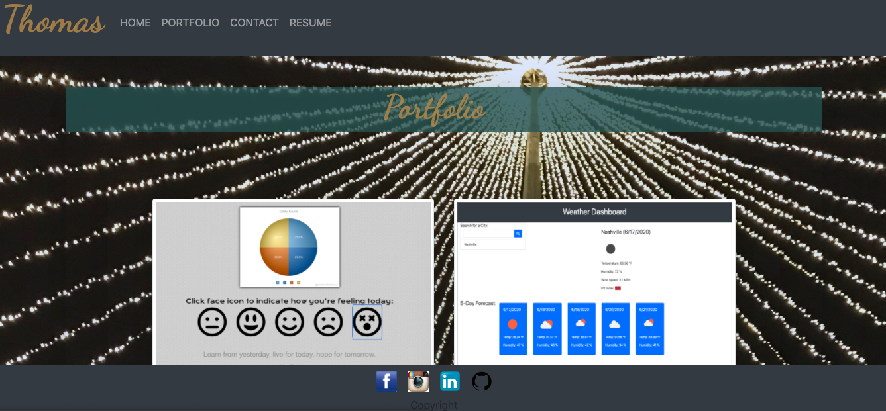
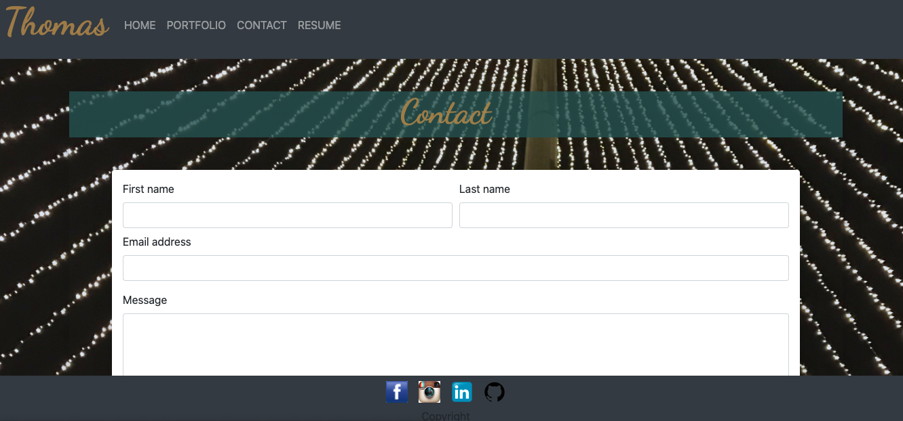
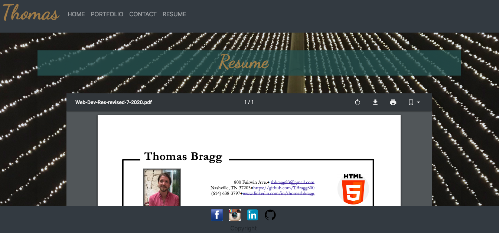

# Week 8 Portfolio Revision

* [Github Repository](https://github.com/TBragg800/Week-8-Portfolio)
* [Github Deployed Site](https://tbragg800.github.io/Week-8-Portfolio/)

### Summary:
The purpose of this assignment is to create a responsive 4 page portfolio. The site has a consistent Navbar with working Nav links on each page. I also added an interactive element to the name expand and collapse "Bragg". I tried to use all of the semantic html I thought made sense and also tested the code with an Html validator. Through that process I encountered and corrected an issue with the aira-describedby attribute. The layout ustilizes the bootstrap grid system on each page and incorporates a mixture of rows, coloumns and further nested rows & columns inside of those elements. I updated the styles and added new hover functionality and a media query to handle mobile background viewport. The site now has portfolio flip-cards with corresponding info and links to the github repo. A resume page utilizing an iframe displays my downloadable or printable resume. I finished each page with a streamlined sticky footer including  a copyright statement social media links and a link to my github profile.

### Pseudo Code:
* Add different background and refine color scheme.
* Change and add different elements to portfolio page.
* Portfolio page elements should link to the repository/add github icon.
* Add section about web dev languages and dev tools used.
* Add page for resume/incorporate resume tools.
* Add animations and hover elements.
* Readme needs a lot of attention.

### Features:
* A home page that titles the site with a photo and brief description about myself.
* A portfolio page offering flip-cards with corresponding info and links to the github repos.
* A contact page with a form for name, email and message.
* A resume page utilizing an iframe displays my downloadable or printable resume.

#### Screenshot of deployed application

